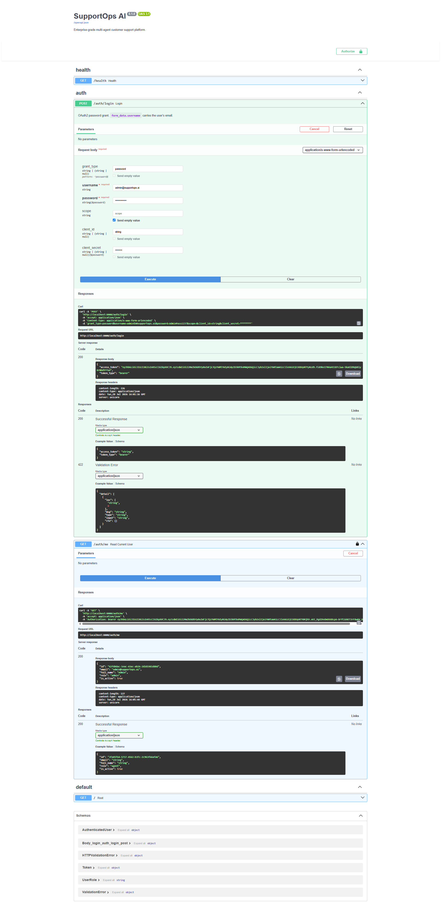
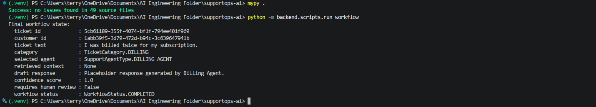

# SupportOps AI

Enterprise-grade multi-agent customer support platform.

## Overview

SupportOps AI orchestrates a team of specialized AI agents (billing, technical,
account, and a General agent) to triage and resolve customer support
requests. Agent orchestration is built with **LangGraph** (stateful control flow)
and **CrewAI** (role-based agent collaboration), exposed via a **FastAPI**
backend, and backed by **PostgreSQL** (persistence) and **Redis** (caching /
short-term memory).

> Status: Sprint 4 scaffold. The LangGraph workflow orchestration backbone
> (`backend/graph/`) is implemented with deterministic placeholder logic;
> everything else is still `TODO` — see `TODO` markers throughout the
> codebase and `docs/decisions.md` for what's pending.

## Tech Stack

- Python 3.12
- FastAPI
- LangGraph
- CrewAI
- OpenAI (LLM provider, via `langchain-openai`)
- PostgreSQL + SQLAlchemy + Alembic
- Redis
- Docker / Docker Compose
- GitHub Actions (CI)
- JWT / OAuth2 authentication
- Pytest

## Authentication

SupportOps AI uses **OAuth2 Password Flow** with **JWT (JSON Web Tokens)** for authentication and authorization.

The authentication system includes:

- OAuth2 Password authentication
- JWT access token generation
- Password hashing using bcrypt
- Protected API endpoints
- Current authenticated user endpoint (`GET /auth/me`)
- Interactive testing through Swagger UI

The screenshot below demonstrates:

- Successful authentication via `POST /auth/login`
- JWT access token issuance
- Authenticated request to `GET /auth/me`
- Retrieval of the currently authenticated user



## Workflow Orchestration

The LangGraph workflow backbone (`backend/graph/`) compiles a fixed graph —
`load_ticket → classify_ticket → select_agent → execute_agent →
confidence_evaluation → persist_results` — with deterministic placeholder
logic in every node, ready for real classification, CrewAI agents, and
persistence to be dropped in without changing the topology.


Running `python -m backend.scripts.run_workflow` against the sample ticket
"I was billed twice for my subscription" routes it to the billing agent end
to end:



## Repository Layout

```
supportops-ai/
├── README.md
├── CLAUDE.md
├── LICENSE
├── .gitignore
├── .env                          # Local environment overrides (git-ignored)
├── .env.example
├── pyproject.toml
├── docker-compose.yml
├── alembic.ini
│
├── alembic/                      # Alembic migration environment (async, targets Base.metadata)
│   ├── README
│   ├── env.py
│   ├── script.py.mako
│   └── versions/                 # Generated migration scripts
│
├── .github/
│   └── workflows/
│       └── ci.yml                # Lint + test CI pipeline (scaffold)
│
├── docs/
│   ├── architecture.md
│   ├── business_requirements.md
│   ├── assumptions.md
│   ├── database_schema.md
│   ├── decisions.md
│   ├── design_review.md
│   ├── adr/
│   │   └── ADR-001-langgraph-vs-crewai.md
│   └── screenshots/
│       ├── 01-authentication-flow.png
│       ├── 02-workflow.png
│       └── 03-langgraph-smoke-test.png
│
├── backend/
│   ├── __init__.py
│   ├── main.py                   # FastAPI application entry point
│   │
│   ├── api/
│   │   ├── __init__.py
│   │   ├── README.md
│   │   │
│   │   ├── routes/               # APIRouter modules (e.g. health)
│   │   │   ├── __init__.py
│   │   │   └── health.py
│   │   │
│   │   ├── dependencies/         # FastAPI Depends providers (auth, db session, ...)
│   │   │   └── __init__.py
│   │   │
│   │   └── middleware/           # ASGI middleware (logging, correlation IDs, ...)
│   │       └── __init__.py
│   │
│   ├── agents/
│   │   ├── __init__.py
│   │   ├── README.md
│   │   │
│   │   ├── billing/               # Billing support agent
│   │   │   └── __init__.py
│   │   │
│   │   ├── technical/             # Technical support agent
│   │   │   └── __init__.py
│   │   │
│   │   ├── account/               # Account management agent
│   │   │   └── __init__.py
│   │   │
│   │   └── general/               # General support agent
│   │       └── __init__.py
│   │
│   ├── graph/                     # LangGraph workflow orchestration backbone
│   │   ├── __init__.py
│   │   ├── README.md
│   │   ├── state.py               # WorkflowState + TicketCategory/SupportAgentType/WorkflowStatus enums
│   │   ├── nodes.py                # load_ticket, classify_ticket, select_agent, execute_agent, confidence_evaluation, persist_results
│   │   └── workflow.py             # build_workflow() / get_graph() — compiles the node graph
│   │
│   ├── policy/                   # Routing, escalation, and guardrail business rules
│   │   ├── __init__.py
│   │   └── README.md
│   │
│   ├── auth/                     # JWT/OAuth2 authentication & authorization
│   │   ├── __init__.py
│   │   ├── README.md
│   │   ├── hashing.py             # Password hashing/verification (passlib/bcrypt)
│   │   ├── jwt.py                 # Access-token issuance & verification (python-jose)
│   │   ├── dependencies.py        # get_current_user, get_current_active_user, require_role
│   │   └── router.py              # POST /auth/login, GET /auth/me
│   │
│   ├── core/                     # Framework-level infra shared across the API
│   │   ├── __init__.py
│   │   ├── README.md
│   │   └── security.py            # OAuth2PasswordBearer scheme, 401/403 exceptions
│   │
│   ├── database/
│   │   ├── __init__.py
│   │   ├── README.md
│   │   ├── base.py                # Declarative Base + UUID/timestamp mixins
│   │   ├── session.py             # Async engine + session factory
│   │   ├── enums.py               # UserRole, CustomerTier, TicketPriority/Status, ApprovalStatus
│   │   │
│   │   ├── models/                # SQLAlchemy declarative models
│   │   │   ├── __init__.py
│   │   │   ├── user.py
│   │   │   ├── customer.py
│   │   │   ├── ticket.py
│   │   │   ├── agent_run.py
│   │   │   ├── approval_request.py
│   │   │   └── audit_log.py
│   │   │
│   │   ├── migrations/            # Alembic migration environment
│   │   │   └── README.md
│   │   │
│   │   └── repositories/          # Repository-pattern data access
│   │       └── __init__.py
│   │
│   ├── services/                 # Application services (routes depend on these)
│   │   ├── __init__.py
│   │   └── README.md
│   │
│   ├── tools/                    # Tool implementations exposed to agents
│   │   ├── __init__.py
│   │   └── README.md
│   │
│   ├── schemas/                  # Pydantic request/response & internal contracts
│   │   ├── __init__.py
│   │   ├── README.md
│   │   └── auth.py                # Token, AuthenticatedUser
│   │
│   ├── config/                   # Settings (env-driven configuration)
│   │   ├── __init__.py
│   │   ├── README.md
│   │   └── settings.py
│   │
│   └── scripts/                  # One-off scripts (python -m backend.scripts.<name>)
│       ├── __init__.py
│       ├── README.md
│       ├── seed.py                # Idempotent dev-data seed (users, customers, tickets)
│       ├── run_workflow.py        # Runs the compiled LangGraph workflow against a sample ticket
│       ├── export_workflow.py     # Renders the compiled graph to workflow.png (Mermaid)
│       └── test_openai.py         # Manual OpenAI/langchain-openai connectivity smoke test
│
├── tests/
│   ├── README.md
│   ├── conftest.py
│   │
│   ├── unit/                     # Fast, isolated tests (mirrors backend/)
│   │   ├── README.md
│   │   └── test_main.py
│   │
│   ├── integration/              # Tests against real Postgres/Redis
│   │   └── README.md
│   │
│   └── fixtures/                 # Shared fixtures, factories, sample data
│       └── README.md
│
└── docker/
    ├── Dockerfile
    └── README.md
```

Every backend subpackage, `docs/`, `tests/`, and `docker/` folder has its own
`README.md` explaining its purpose in more detail — see the `README.md` inside
each subdirectory.

## Getting Started

### Prerequisites

- Python 3.12+
- Docker & Docker Compose
- [uv](https://github.com/astral-sh/uv) or `pip` for dependency management

### Local development

```bash
# Install dependencies
pip install -e ".[dev]"

# Run the API locally
uvicorn backend.main:app --reload

# Run the full stack (API + Postgres + Redis)
docker compose up --build
```

### Database migrations & seeding

```bash
# Apply migrations (schema)
alembic upgrade head

# Seed baseline dev data: 4 users, 5 demo customers, 15 demo tickets.
# Idempotent -- safe to run more than once.
python -m backend.scripts.seed
```

### Running the LangGraph workflow

```bash
# Runs the compiled workflow against a sample ticket and prints the final
# state. No LLM, database, or Redis required -- every node is a deterministic
# placeholder (see backend/graph/README.md).
python -m backend.scripts.run_workflow
```

### Running tests

```bash
pytest
```

## Documentation

- [Architecture](docs/architecture.md)
- [Business Requirements](docs/business_requirements.md)
- [Assumptions](docs/assumptions.md)
- [Decisions](docs/decisions.md)
- [Design Review](docs/design_review.md)
- [ADRs](docs/adr/)

## Project Conventions

See [CLAUDE.md](CLAUDE.md) for repository-specific engineering conventions and
guidance for AI-assisted development in this codebase.

## License

See [LICENSE](LICENSE).
