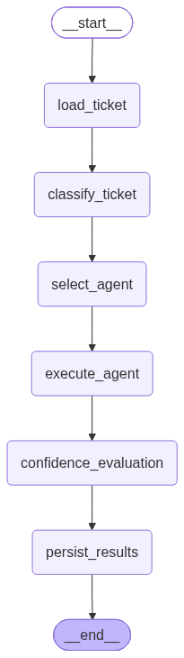

# SupportOps AI — Technical Architecture

An enterprise-style multi-agent customer support platform — LangGraph workflow orchestration around CrewAI specialist agents, with a deterministic policy engine gating every risky action.

| | |
|---|---|
| **Project Type** | Self-directed portfolio project. Not a production deployment — no real company or customer data behind it. |
| **Document** | Technical Architecture Reference |
| **Primary Source** | `docs/architecture.md` |
| **Prepared** | 2026 |
| **Test Suite** | 167 automated tests passing (`pytest`) |

`Python 3.12` `FastAPI` `LangGraph` `CrewAI` `PostgreSQL` `167 Tests Passing`

> **How to read this document:** every capability described here is marked either *Implemented*, *Partially implemented*, or *Design only*. The codebase itself names its remaining gaps as `TODO` markers rather than half-building them silently — this document surfaces the ones that matter architecturally rather than hiding behind "mostly done."

## Contents

1. [System Architecture](#section-1--system-architecture)
2. [Component Responsibilities](#section-2--component-responsibilities)
3. [Data Flow](#section-3--data-flow)
4. [Technology Choices](#section-4--technology-choices)
5. [Error Handling & Resilience](#section-5--error-handling--resilience)
6. [Testing Approach](#section-6--testing-approach)
7. [Known Gaps & Roadmap](#section-7--known-gaps--roadmap)
8. [Resources](#resources)

## Section 1 · System Architecture

SupportOps AI orchestrates four specialist AI agents (billing, technical, account, general) behind a FastAPI backend to triage and draft responses to customer support tickets. LangGraph owns the workflow's control flow — state, classification, routing, escalation — while CrewAI supplies the specialist agents it calls into for domain reasoning. A deterministic policy engine, not the model, decides whether a ticket needs human approval before anything reaches a customer.

PostgreSQL is the system of record for all business data. Redis is ephemeral infrastructure only — rate limiting, idempotency, workflow checkpoints, and AI/knowledge-base caching — chosen so a Redis outage can never lose business data (see Section 2's Redis callout).

**Pipeline Overview**

```
load_ticket                (backend/graph/nodes.py)      — initializes WorkflowState
        ↓
classify_ticket             (backend/graph/classifier.py) — OpenAI structured output, Redis-cached
        ↓
select_agent                (backend/graph/nodes.py)      — deterministic category → specialist mapping
        ↓
execute_agent                (backend/agents/)              — CrewAI specialist, grounded via KB tool
        ↓
confidence_evaluation        (backend/policy/rules.py)      — deterministic policy + agent_unresolved signal
        ↓
persist_results               (backend/services/)             — writes to Postgres; enqueues ApprovalRequest if flagged
```

*Four of these six nodes also save a best-effort Redis checkpoint after running — diagnostics/recovery only, never required for correctness.*

**Compiled Workflow Graph**

The topology above is a real, compiled LangGraph graph, exported via `backend.scripts.export_workflow`. It has stayed structurally fixed even as every node's implementation moved from placeholder to real — a deliberate separation between the workflow's shape and its node internals.


*Fig. 1 — The compiled six-node LangGraph workflow.*

## Section 2 · Component Responsibilities

`DONE` implemented in production code · `PARTIAL` implemented in part · `NOT BUILT` not yet built

| Capability | Owns | Status |
|---|---|---|
| JWT / OAuth2 authentication | `backend/auth/` — password hashing, token issuance/verification, role dependencies | DONE |
| LangGraph workflow orchestration | `backend/graph/` — fixed 6-node graph, state, checkpointing | DONE |
| CrewAI specialist agents | `backend/agents/` — billing, technical, account, general, grounded via KB tool | DONE |
| OpenAI ticket classification | `backend/graph/classifier.py` — structured outputs, Redis-cached | DONE |
| Policy / escalation engine | `backend/policy/rules.py` — deterministic keyword/threshold rules | DONE |
| Supervisor approval queue | `backend/api/supervisor.py` — real Postgres-backed view/approve/edit/reject | DONE |
| Idempotent ticket creation | `backend/services/idempotency.py` — atomic Redis claim, fails closed | DONE |
| Distributed rate limiting | `backend/core/rate_limit.py` — Redis-backed, in-memory fallback | DONE |
| Audit logging | `backend/services/audit.py` — real Postgres `audit_logs` rows | DONE |
| Postgres persistence + migrations | `backend/database/` — repository pattern, Alembic migration per table | DONE |
| Confidence scoring | `backend/graph/nodes.py` — currently `_PLACEHOLDER_CONFIDENCE_SCORE`, a fixed value, not model-derived | NOT BUILT |
| Per-tenant policy thresholds | `backend/policy/rules.py` — thresholds are global today, not per-tenant | NOT BUILT |
| Correlation-ID / centralized error middleware | `backend/api/middleware/` — package exists, not implemented | NOT BUILT |
| Additional agent tools (billing system, ticketing/CRM lookups) | `backend/tools/` — only the knowledge-base tool exists today | PARTIAL |
| Structured (JSON) logging | `backend/core/logging.py` — plain formatter today; log level not yet sourced from settings | PARTIAL |
| Dedicated `TicketRepository` | `backend/database/repositories/` — ticket persistence currently lives in the service layer, not a repository | NOT BUILT |

> **Confidence scoring is a fixed placeholder.** `confidence_evaluation_node` currently reads a constant, `_PLACEHOLDER_CONFIDENCE_SCORE`, rather than a real score derived from the model's own output. Escalation itself is still deterministic and correct — it runs on the policy engine's keyword/threshold rules and the agent's explicit `agent_unresolved` signal, neither of which depend on this placeholder — but "how confident was the agent" is not yet a real, trustworthy number. Named honestly in the code (the constant's name says what it is) rather than presented as calibrated.

**Module Ownership Boundaries**

- `backend/graph/` — workflow control flow, state, checkpointing
- `backend/agents/` — CrewAI specialist reasoning; no workflow control
- `backend/policy/` — escalation/routing rules; the only place that decides human review
- `backend/api/` — HTTP orchestration only
- `backend/database/` — SQLAlchemy models + repository-pattern data access
- `backend/core/` — framework-level infra: Redis client, rate limiting, security, cache
- `backend/services/` — application services routes depend on (idempotency, audit, ticket)
- `backend/tools/` — tool implementations exposed to CrewAI agents

## Section 3 · Data Flow

End-to-end, a single ticket submission moves through the system as follows:

1. A client calls `POST /tickets` with an `Idempotency-Key` header; a repeated key replays the original response instead of re-running the workflow.
2. `customer_id` is validated against Postgres before insert, returning a clean 404 (not a raw foreign-key violation) for an unknown one.
3. The LangGraph workflow runs: `load_ticket → classify_ticket → select_agent → execute_agent → confidence_evaluation → persist_results`.
4. `classify_ticket` calls OpenAI for structured-output classification (Redis-cached by ticket text).
5. `execute_agent` runs the matched CrewAI specialist, grounded by a Postgres knowledge-base lookup tool (also Redis-cached).
6. `confidence_evaluation` runs the ticket through `policy/rules.py`'s deterministic rules plus the agent's `agent_unresolved` signal.
7. `persist_results` writes the outcome to Postgres, and — if the policy flagged it — enqueues a real `ApprovalRequest` row for a Supervisor/Admin to review.
8. Every view/approve/edit/reject action on a flagged ticket writes its own `audit_logs` row.

**Request/Response Shape**

```
POST /tickets → LangGraph → classify_ticket → execute_agent (CrewAI) → confidence_evaluation → persist_results → JSON Response
```

**Supervisor Review Routes**

- `GET /supervisor/queue` — list tickets pending approval
- `GET /supervisor/queue/{ticket_id}` — fetch a single queue entry
- `POST /supervisor/queue/{ticket_id}/approve` · `/edit` · `/reject` — act on a ticket's draft response, each writing an audit row

## Section 4 · Technology Choices

| Component | Technology | Why |
|---|---|---|
| Backend API | FastAPI | Async-first, typed, built-in OpenAPI docs for the ticket/supervisor contracts |
| Workflow orchestration | LangGraph | Graph-based control flow with first-class state persistence, conditional routing, and human-in-the-loop interrupts |
| Specialist reasoning | CrewAI | Role/task abstraction for domain agents without hand-rolling their reasoning loop |
| System of record | PostgreSQL | Durable storage for tickets, approvals, audit logs — never at risk from a Redis outage |
| Ephemeral infra | Redis | Rate limiting, idempotency, checkpoints, caching — everything safe to lose and rebuild |
| Auth | JWT / OAuth2 | Stateless, standard, works cleanly with FastAPI's `Depends` system |

**Why LangGraph *and* CrewAI (ADR-001)** — LangGraph owns deterministic workflow control — ticket state, classification routing, policy evaluation, human-in-the-loop escalation, persistence. CrewAI implements the Billing, Technical, Account, and General agents that generate domain-specific responses, but never control workflow execution or escalation. The explicit trade-off: two frameworks means more integration surface and cross-component debugging, accepted in exchange for a hard boundary between "AI reasons" and "system decides" that a single framework couldn't enforce as cleanly. Alternatives considered and rejected: LangGraph-only (would mean hand-rolling role-based agents, losing modularity) and CrewAI-only (would make deterministic routing, state persistence, and human approval checkpoints harder to implement consistently). Full write-up: `docs/adr/ADR-001-langgraph-vs-crewai.md`.

**Why Postgres as the only system of record** — Every feature built on Redis — rate limiting, idempotency, checkpoints, caching — is explicitly ephemeral: a miss recomputes, an outage degrades rather than corrupts. The one deliberate exception is idempotency, which fails *closed* (a 503 rather than risking a duplicate ticket) because "no duplicate tickets" is a correctness requirement, not a performance concern. This split is what lets the platform honestly claim that a Redis outage never puts business data at risk.

## Section 5 · Error Handling & Resilience

**Cross-Event-Loop Client Isolation** — The app legitimately runs two long-lived event loops: FastAPI's own request-handling loop, and a dedicated background loop `backend.core.asyncio_utils.run_sync` uses to bridge LangGraph's synchronous node functions back into async Redis/Postgres calls. Both `redis.asyncio.Redis` and SQLAlchemy's async engine hold connections bound to whichever loop first uses them. Sharing one client across both loops used to crash with a `RuntimeError` — for Postgres, it could poison a pooled connection so a later, unrelated request drawing that same connection would 500, which made the bug look intermittent and unrelated to its real trigger. Fixed by handing out one client/engine per calling loop (`get_redis_client()`, `async_session_factory()`), with real-Redis/real-Postgres regression tests (`tests/integration/test_ticket_workflow.py`, `test_idempotency_cross_loop.py`).

**Degradation Policy, Chosen Per Feature**

| Feature | On Redis failure | Rationale |
|---|---|---|
| AI classification / KB cache | Fails open — recomputes | A cache miss is just slower, never wrong |
| Workflow checkpoints | Fails open — no checkpoint saved | Diagnostics/recovery only, never required for correctness |
| Rate limiting | Fails open, to a looser fallback ceiling | Availability preferred over precise per-route limits during an outage |
| Idempotency | Fails **closed** — 503 | Silently proceeding could let a genuine duplicate ticket through |

> **Design principle:** a specialist agent can report it's unresolved, but it never decides escalation. That decision belongs entirely to the deterministic policy engine — a hard boundary between AI reasoning and system control, not just a convention.

## Section 6 · Testing Approach

167 tests total: 159 unit tests with Redis mocked via `fakeredis` and Postgres via test doubles, plus 8 integration tests against a real Redis and/or Postgres that skip themselves — rather than fail — when the service they need isn't reachable, so a plain `pytest` run is always safe regardless of what's running locally.

```
pytest  →  167 passed
```

| Area | What's verified |
|---|---|
| Graph nodes | classify_ticket, execute_agent, persist_results, checkpoint save/read behavior |
| Policy engine | Escalation rules, adversarial input handling |
| Supervisor API | Queue listing, approve/edit/reject flows, adversarial cases |
| Services | Idempotency store (atomic claim, fail-closed), audit logging, ticket creation + execution |
| Core infra | Rate limiting (Redis + fallback), caching, asyncio bridge, Redis client lifecycle |
| Auth | JWT issuance/verification, rate-limit key resolution |
| Integration | Real ticket workflow against live Redis/Postgres, cross-loop client isolation, live schema vs. model drift (`alembic check`) |

## Section 7 · Known Gaps & Roadmap

Named plainly rather than glossed over — these are the gaps that matter architecturally, distinct from the smaller per-module `TODO` markers scattered through the codebase.

| Gap | Why it matters |
|---|---|
| Confidence score is a fixed placeholder | Escalation itself is still correct (policy rules + `agent_unresolved` don't depend on it), but there's no real signal for "how sure was the agent" yet |
| Single-tenant policy thresholds | Refund/threshold values are global constants, not per-tenant configuration — a multi-tenant deployment would need this first |
| No correlation-ID / centralized error middleware | Tracing a single request across logs today relies on timestamps and ticket IDs, not a request-scoped correlation ID |
| Only one agent tool exists (knowledge base) | Billing-system and ticketing/CRM lookups are scaffolded but not implemented — agents can answer from documentation, not live account data |
| Logging is plain-text, not structured | No JSON log formatter yet, so log aggregation would need a parser rather than ingesting structured fields directly |

## Resources

Want to verify or explore this further? Here you go.

| | |
|---|---|
| **GitHub repository** — full source, commit history, 167 passing tests | [github.com/Terrytd0/Supportops-AI](https://github.com/Terrytd0/Supportops-AI) |
| **README** — setup, feature list, architecture overview | [README.md](https://github.com/Terrytd0/Supportops-AI/blob/main/README.md) |
| **Demo video** — live walkthrough of the workflow end to end | [Watch on Google Drive](https://drive.google.com/file/d/1l83yIoBXb22EAfT8fKwjv2sd-idlKNDQ/view?usp=drive_link) |
| **Case Study** — the companion document to this architecture reference | [case-study.md](case-study.md) |
| **Full docs folder** — architecture, requirements, ADRs, design review | [docs/](https://github.com/Terrytd0/Supportops-AI/tree/main/docs) |

---
*SupportOps AI · Technical Architecture · Self-directed portfolio project*
